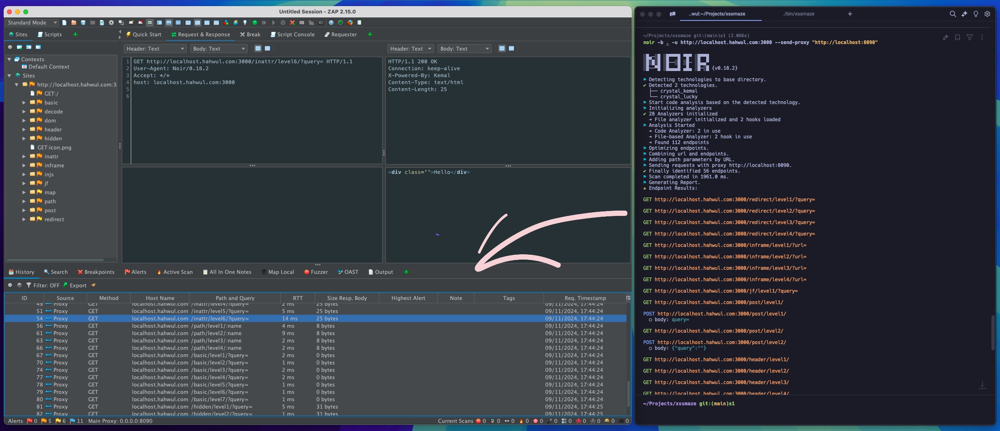

Endpoint discovery is a crucial task for any dynamic application security testing (DAST) tool. An endpoint refers to a specific part of the application that can be tested by tools or people. It plays a vital role in security, especially in DevSecOps and AppSec, as many vulnerabilities are discovered in endpoints, such as APIs, that are often overlooked during operation or development.

I am a long-time user and big fan of ZAP and the developer of a tool called Noir. This article explores the integration of ZAP and Noir to achieve better endpoint detection and testing outcomes.

## Endpoints Detection in ZAP

ZAP includes several mechanisms designed to optimize endpoint discovery. The tool offers features like Spider and Ajax Spider, which aid in efficiently identifying endpoints. Furthermore, ZAP incorporates tasks like the "[ZAP vs. Security Crawl Maze](https://www.zaproxy.org/docs/scans/crawlmaze/)", a set of challenges to refine and test its endpoint detection capabilities. ZAP can also parse Open API Specifications (OAS), such as Swagger files, enabling it to capture and integrate documented endpoints into its scans.

## White-box Testing and Noir

While the BugBounty community may rarely encounter source code access, security engineers within organizations often work with source code directly. Analyzing source code alongside endpoints provides a more robust approach to vulnerability detection, but not all developers use OAS, and additional endpoints not documented in OAS may still be present in the source code.

This is where Noir comes in. Developed to discover hidden endpoints within source code, Noir identifies not only URL Endpoints but also parameters, headers, cookies, and other potential attack vectors. In addition to uncovering endpoints, Noir checks for the use of various technologies and identifies security issues associated with them. This allows security engineers to leverage the gathered information in security testing.

In 2024, Noir officially became part of the OWASP project and is now known as OWASP Noir.
Please refer to Noir’s [documentation for installation instructions](https://owasp-noir.github.io/noir/get_started/installation/), and our [Github](https://github.com/owasp-noir/noir) repository for more information about Noir.

## Integration of Noir with ZAP
### Manual Testing

In a manual testing scenario, integrating Noir with ZAP is straightforward. Noir can analyze endpoints and send them to ZAP using the `--send-proxy` flag. This method populates ZAP’s History and Sites tabs, preparing endpoints for direct analysis within ZAP’s interface.
Example command:

```sh
# -b: source code path
# -u: target url
# --send-proxy: your ZAP listen port

noir -b . -u http://localhost.hahwul.com:3000 --send-proxy "http://localhost:8090"
```



You can also pass predefined headers like X-API-Key and Authorization headers by using the `-H` flags.

### Automated Scanning

ZAP’s scanning capabilities make it ideal for DAST implementations in DevSecOps, and integrating Noir with ZAP enhances this process. Noir can export results in multiple formats, including JSON and YAML, with support for OAS specifications. An example of generating OAS output with Noir is shown below:

```sh
noir -b <SOURCE> -f oas3 --no-log -o <OUTPUT>
```

In this article, we will use the OAS format.

#### Command Line

ZAP can then use these results by setting endpoint details through the `-openapifile` and `-openapitargeturl` flags when executed via the command line. With these two flags, you can configure the automation scan to include additional endpoints discovered through Noir, as shown in the command below.

```sh
# Discovering endpoints
noir -b ~/app_source -f oas3 --no-log -o doc.json

# Automation scan with endpoints
./zap.sh -openapifile ./doc.json \
    -openapitargeturl <TARGET> \
    -cmd -autorun zap.yaml <any other ZAP options>
```


#### Docker image
In [zap-baseline.py](https://www.zaproxy.org/docs/docker/baseline-scan/#usage), [zap-full-scan.py](https://www.zaproxy.org/docs/docker/full-scan/#usage) and [zap-api-scan.py](https://www.zaproxy.org/docs/docker/api-scan/#usage) of the zaproxy/zap-stable docker image, you can pass the argument value of zap.sh through the `-z` flag. Consequently, you can pass the OAS file obtained using noir to zap.

```sh
python zap-baseline.py \
    -t <TARGET> \
    -z "-openapifile './doc.json' -openapitargeturl <TARGET>"
```

Full command:

```sh
# Discovering endpoints
noir -b ~/app_source -f oas3 --no-log -o doc.json

# Scan with zaproxy/zap-stable
docker run -t -v $(pwd)/doc.json:/zap/doc.json \
  zaproxy/zap-stable zap-baseline.py -t <TARGET> \
  -z "-openapifile /zap/doc.json -openapitargeturl <TARGET>"
```

You can use it in a similar way in Github Actions.

### Alternative Methods

Alternative methods include registering with Sites using ZAP’s REST API or passing the information to a proxy port on an active ZAP instance for recognition. The choice of method is entirely up to you.

## Conclusion

Integrating Noir with ZAP allows ZAP to scan a broader range of endpoints, enhancing results. By combining these tools, security teams can strengthen the DevSecOps pipeline.

Additionally, we are working to integrate Noir with ZAP's REST API functionalities and automation features to streamline the integration process. Stay tuned for updates!